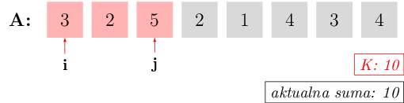
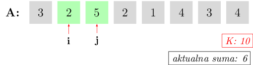

# Sumy w tablicach

## Zapytania

Na początku tej lekcji zajmiemy się następującym zadaniem:

*W Bajtocji dobiegł właśnie końca kolejny rok podatkowy. Zeznania podatkowe obywateli leżą przed Tobą, jeszcze bez żadnego porządku. Nowy rząd chce od Ciebie odpowiedzi na zupełnie inne pytanie: zapytany o pewną grupę Bajtocjan tworzącą spójny przedział (czyli od $a$-tego do $b$-tego Bajtocjanina włącznie, dla pewnych $a$ i $b$) powiedz, ile wynosi ich łączny zysk.*

Pełną treść (oraz, jak zwykle, możliwość zgłoszenia rozwiązania) znajdziesz pod poniższym linkiem:

[Zeznania podatkowe :fontawesome-solid-paper-plane:](https://szkopul.edu.pl/c/kurs-oi/p/#zep){ .md-button .md-button--primary }

Innymi słowy, dana jest pewna tablica liczb, a także pewna liczba **zapytań**, czyli w tym wypadku par $(a,b)$. Twój program musi dla każdej takiej pary wypisać odpowiedź – sumę elementów tablicy od $a$-tego do $b$-tego włącznie. Przykładowe dane w treści naszego zadania wyglądają tak:

```
5
3 1 4 2 3
3
1 4
3 3
3 5
```

Oznacza to, że nasza tablica będzie składała się z $5$ liczb i będzie wyglądała tak:

<div class="oneline-table" markdown>
| 3 | 1 | 4 | 2 | 3 |
|:-:|:-:|:-:|:-:|:-:|
</div>


Program musi wypisać odpowiedzi na $3$ zapytania: najpierw dla $a = 1$ i $b = 4$, czyli sumę od pierwszego do czwartego elementu. Jest to $3 + 1 + 4 + 2 = 10$. Potem z kolei trzeba znaleźć sumę od elementu trzeciego do trzeciego (czyli po prostu $4$), a na końcu sumę od trzeciego do piątego ($4 + 2 + 3 = 9$).

Sytuacja, w której mamy pewien zbiór danych i musimy udzielać o nim informacji – czyli odpowiadać na zapytania – jest bardzo częsta w informatyce. Na podobnej zasadzie działają bazy danych, dyski twarde w naszych komputerach, wyszukiwarki internetowe, i tak dalej. Może się nawet zdarzyć (choć akurat nie w tym wypadku), że pomiędzy zapytaniami nasze dane zmieniają się, i musimy takie zmiany uwzględniać w kolejnych odpowiedziach.

## Sumy prefiksowe

Wiemy zatem, że w danym przykładzie mamy daną tablicę `A` o $n$ elementach, i musimy obliczyć bardzo wiele sum postaci `A[p] + A[p + 1] + ... + A[q]` dla różnych `p` i `q`. Najprostszym sposobem może wydawać użycie pętli, która przechodzi od $p$-tego do $q$-tego elementu i zwyczajnie dodaje je do siebie. Taki sposób będzie jednak zdecydowanie zbyt wolny: pojedyncze zapytanie może wymagać nawet $n$ kroków pętli. Ponieważ zarówno długość tablicy, jak liczba zapytań w naszym zadaniu mogą być liczbami rzędu $1\,000\,000$, nie możemy sobie na to pozwolić. Musimy znaleźć sposób, aby na zapytania odpowiadać błyskawicznie. Taki sposób okazuje się zadziwiająco prosty – obliczamy najpierw pomocnicze sumy:

```
S[0] = 0
S[1] = A[1]
S[2] = A[1] + A[2]
...
S[n] = A[1] + A[2] + ... + A[n]
```

Możemy to łatwo zrobić jedną pętlą typu `for`. Co jest najważniejsze, możemy teraz zauważyć, że każda suma `A[p] + A[p + 1] + ... + A[q]` daje się wyrazić jako `S[q] - S[p - 1]`. Takie pomocnicze sumy nazywają się **sumami prefiksowymi** i pozwalają zastąpić dużą liczbę dodawań zaledwie jednym odejmowaniem.

W zadaniach, w których musimy odpowiadać na pewne zapytania, często będziemy używać podobnej techniki: zamiast wykonywać pętlę przy każdym zapytaniu, przygotowujemy sobie na samym początku pewne pomocnicze wartości, tablice, a czasem bardziej skomplikowane struktury. One pozwalają potem na bardzo szybkie odpowiadanie na zapytania. Technika ta zwana jest z angielska **preprocessingiem**.

## Gąsienica

Wróćmy do zadania z rozdziału "Złożoność obliczeniowa", o liczeniu fragmentów ciągu o zadanej sumie:

*"Dany jest ciąg złożony z $n$ liczb całkowitych dodatnich. Rozstrzygnąć, ile jest jego fragmentów o sumie równej dokładnie $K$."*

W tamtym rozdziale doszliśmy do algorytmu, który wykonywał około $\frac{1}{2}n^2$ operacji dodawania. Okazuje się, że możemy znaleźć algorytm jeszcze szybszy! Zaczynamy podobnie jak w tamtej wersji: dla każdego `i` będziemy chcieli znaleźć takie `j > i`, że `A[i] + ... + A[j] = K`.

Zacznijmy od `i = 0` i zwiększajmy `j`, aż suma `A[0] + A[1] + ... + A[j]` będzie równa `K`:


{class="image-color-invert"}

*W powyższym przykładzie `K = 10`. Dla `i = 0` znaleźliśmy `j = 2`, bo suma `A[0] + A[1] + A[2]` to dokładnie 10.*

Wszystkie większe `j` dałyby już sumę większą niż `K`, nie ma więc sensu ich sprawdzać – możemy porzucić `i = 0` i przejść do `i = 1`. Teraz jednak zamiast zaczynać zupełnie nową pętlę dla `j`, pozostawmy jego aktualną wartość – wszystkie mniejsze `j` dawały zbyt małą sumę przy `i = 0`, więc tym bardziej będą zbyt małe dla `i = 1`. Po prostu zwiększamy zatem `i`, po czym i rozważamy nową aktualną sumę. Może się teraz oczywiście zrobić mniejsza od `K`:

{class="image-color-invert"}

Znowu zwiększamy `j`, aż suma osiągnie `K`:

{class="image-color-invert"}

Kiedy znajdziemy odpowiedni `j`, znowu zwiększamy `i` i powtarzamy całą procedurę. Co jednak, jeśli dla pewnego `i` nie możemy osiągnąć sumy dokładnie `K`, bo jedna jest zbyt mała, a kolejna już przekracza `K`? Wtedy zatrzymujemy się na pierwszej sumie przekraczającej `K`:

{class="image-color-invert"}

Odpowiedni kod w C++ wygląda następująco:

```cpp
int licznik = 0; // Tu będziemy zliczać fragmenty o sumie K.
int suma = A[0]; // Aktualna suma.
int j = 0;
for (int i = 0; i < n; i++) { // Dla ustalonego i:
    while ((j < n - 1) && (suma < K)) {
        j++; 			// Zwiększaj j, doliczając A[j] do sumy...
        suma += A[j]; 	// ... dopóki suma nie przekroczy K.
	}					// (...albo dopóki j nie osiągnie maksymalnej wartości n - 1.)
    if (suma == K) {
        licznik++;
    }
    suma -= A[i]; // Przechodzimy od i do i + 1, trzeba odliczyć A[i] od sumy.
}
```

Na pierwszy rzut oka mamy w środku podwójną pętlę, więc algorytm wygląda na kwadratowy. Czy jednak na pewno? Pętla wewnętrzna ma zmienną długość, dla różnych `i` będzie wykonywać raz więcej, raz mniej iteracji. Najczęściej wykonywaną instrukcją, wykonującą się w każdej iteracji pętli wewnętrznej, jest instrukcja `j++`, czyli przesunięcie prawego końca przedziału $[i, j]$. Ale wartość zmiennej `j` nie może przekroczyć $n$, a jeśli osiągnie $n$, to wewnętrzna pętla po prostu nie będzie się wykonywać. Zatem instrukcja `j++` może wykonać się łącznie, we wszystkich okrążeniach pętli, co najwyżej $n$ razy. Zatem algorytm wykonuje $n$ operacji, czyli jest liniowy!

Technika ta zwana jest (nieformalnie) **gąsienicą** – fragment tablicy, który składa się na sumę, na przemian ścieśnia się i rozszerza, jednocześnie przesuwając się do przodu tablicy, co przywodzi na myśl poruszanie się gąsienicy.


## Zadania

[Mijanka :fontawesome-solid-paper-plane:](https://szkopul.edu.pl/c/kurs-oi/p/#mij){ .md-button .md-button--primary }

[Smakołyki :fontawesome-solid-paper-plane:](https://szkopul.edu.pl/c/kurs-oi/p/#sma){ .md-button .md-button--primary }
