# Przeszukiwanie w głąb

Poznaliśmy już algorytm BFS, a teraz poznamy alternatywny sposób przeszukiwania
grafu, który ze względu na swoją prostotę implementacji jest używany dużo
częściej. Jest to metoda przeszukiwania w głąb (Depth First Search).

## Kolejka a stos

Przpomnijmy sobie jak wygląda przeszukiwanie wszerz:

```cpp
vector<int> odkryty(n);
queue<int> Q;
odkryty[zrodlo] = true;
Q.push(zrodlo);
while (!Q.empty()) {
  v = Q.front();
  Q.pop();

  for (int u : G[v]) {
    if (!odkryty[u]) {
      odkryty[u] = true;
      Q.push(u);
    }
  }
}
```

Mamy zatem trzy rodzaje wierzchołków:

- Nieodkryte.
- Znajdujące się na kolejce.
- Odwiedzone.

W każdej iteracji algorytmu bierzemy wierzchołek z kolejki i odwiedzamy go,
wrzucając na kolejkę wszystkich jego nieodkrytych sąsiadów.

Co, gdybyśmy jednak zamiast kolejki użyli innego kontenera, na przykład stosu?
Czy nadal odwiedzilibyśmy te same wierzchołki? Okazuje się, że tak. Nadal mamy
własność, że jeżeli odwiedzimy wierzchołek $v$, to wszystkich jego sąsiadów w
końcu też odwiedzimy. Czyli jeżeli ze źródła istnieje ścieżka $s \rightarrow v_1
\rightarrow v_2 \rightarrow \ldots \rightarrow v_k \rightarrow v$, to skoro
odwiedzamy źródło, to $v_1$ też, tak samo $v_2$, i tak dalej, aż w końcu $v$.

Popatrzmy jak algorytm używający stosu przebiegałby na poniższym grafie:

<div id='graph1' markdown>
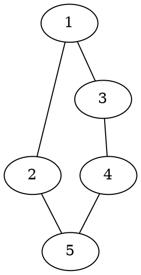
<div class="oneline-table" markdown>
| Stos: ||
|:----:||
</div>
</div>
<div id='graph2' markdown>
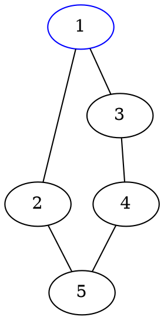
<div class="oneline-table" markdown>
| Stos: || 1 |
|:----:||:-:|
</div>
</div>
<div id='graph3' markdown>
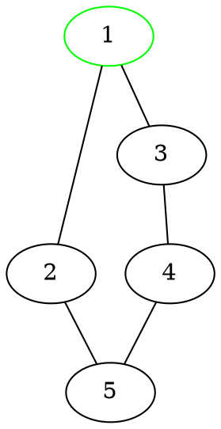
<div class="oneline-table" markdown>
| Stos: || <s>1</s> |
|:-----:||:--------:|
</div>
</div>
<div id='graph3-1' markdown>

<div class="oneline-table" markdown>
| Stos: ||
|:-----:||
</div>
</div>
<div id='graph4' markdown>
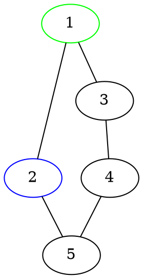
<div class="oneline-table" markdown>
| Stos: || 2 |
|:-----:||:-:|
</div>
</div>
<div id='graph5' markdown>
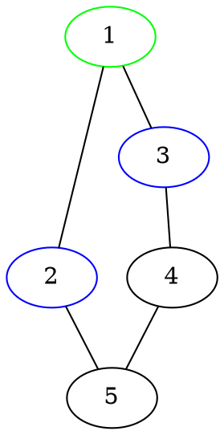
<div class="oneline-table" markdown>
| Stos: || 2 | 3 |
|:-----:||:-:|:-:|
</div>
</div>
<div id='graph6' markdown>
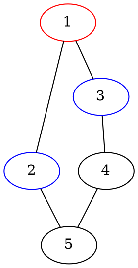
<div class="oneline-table" markdown>
| Stos: || 2 | 3 |
|:-----:||:-:|:-:|
</div>
</div>
<div id='graph7' markdown>
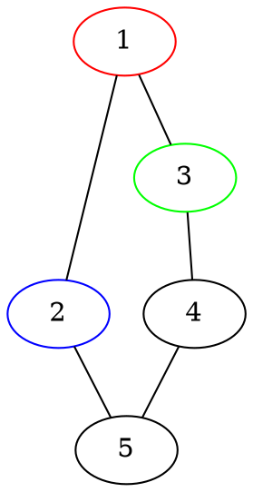
<div class="oneline-table" markdown>
| Stos: || 2 | <s>3</s> |
|:-----:||:-:|:--------:|
</div>
</div>
<div id='graph7-1' markdown>

<div class="oneline-table" markdown>
| Stos: || 2 |
|:-----:||:-:|
</div>
</div>
<div id='graph8' markdown>
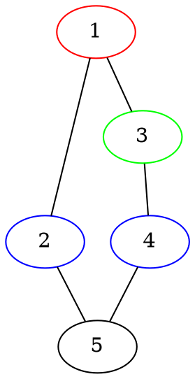
<div class="oneline-table" markdown>
| Stos: || 2 | 4 |
|:----:||:-:|:-:|
</div>
</div>
<div id='graph9' markdown>
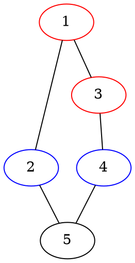
<div class="oneline-table" markdown>
| Stos: || 2 | 4 |
|:-----:||:-:|:-:|
</div>
</div>
<div id='graph10' markdown>
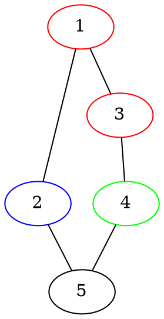
<div class="oneline-table" markdown>
| Stos: || 2 | <s>4</s> |
|:-----:||:-:|:--------:|
</div>
</div>
<div id='graph10-1' markdown>

<div class="oneline-table" markdown>
| Stos: || 2 |
|:-----:||:-:|
</div>
</div>
<div id='graph11' markdown>
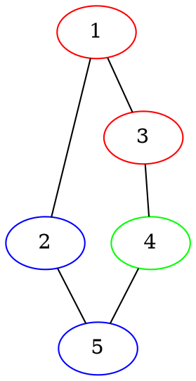
<div class="oneline-table" markdown>
| Stos: || 2 | 5 |
|:-----:||:-:|:-:|
</div>
</div>
<div id='graph12' markdown>
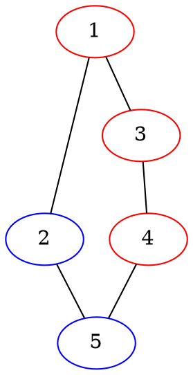
<div class="oneline-table" markdown>
| Stos: || 2 | 5 |
|:-----:||:-:|:-:|
</div>
</div>
<div id='graph13' markdown>
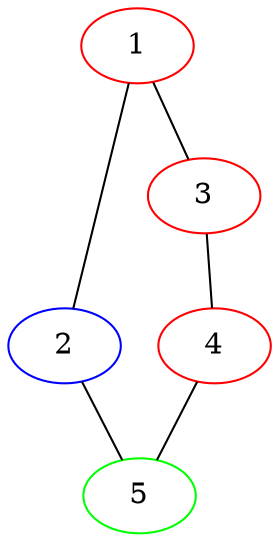
<div class="oneline-table" markdown>
| Stos: || 2 | <s>5</s> |
|:-----:||:-:|:--------:|
</div>
</div>
<div id='graph13-1' markdown>

<div class="oneline-table" markdown>
| Stos: || 2 |
|:-----:||:-:|
</div>
</div>
<div id='graph14' markdown>
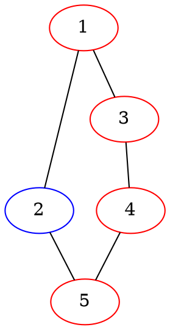
<div class="oneline-table" markdown>
| Stos: || 2 |
|:-----:||:-:|
</div>
</div>
<div id='graph15' markdown>
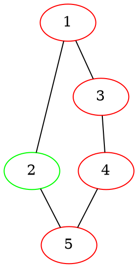
<div class="oneline-table" markdown>
| Stos: || <s>2</s> |
|:-----:||:--------:|
</div>
</div>
<div id='graph15-1' markdown>

<div class="oneline-table" markdown>
| Stos: ||
|:-----:||
</div>
</div>
<div id='graph16' markdown>
```dot
graph G {
  1 [color=red]
  2 [color=red]
  3 [color=red]
  4 [color=red]
  5 [color=red]
  1 -- 2
  2 -- 5
  1 -- 3
  3 -- 4
  4 -- 5
}
```
<script src="https://code.jquery.com/jquery-3.7.1.min.js"></script>
<div class="oneline-table" markdown>
| Stos: ||
|:-----:||
</div>
</div>
<script>
jQuery(function () {
  var $els = $('div[id^=graph]'),
    i = 0,
    len = $els.length;
  $els.slice(1).hide();
  setInterval(function () {
    $els.eq(i).hide(0, function () {
      i = (i + 1) % len
      $els.eq(i).show();
    })
  }, 1500)
})
</script>

## Co wybrać, BFS czy DFS?

Zauważmy, że jeżeli próbowalibyśmy przypisywać wierzchołkom powyższego grafu
odległości tak samo, jak robimy to w algorytmie BFS, to odległość wierzchołka
$5$ od wierzchołka $1$ wyszłaby nam $3$ zamiast $2$. Nie jest to żaden błąd, ale
znak, że algorytm DFS po prostu nie nadaje się do tego zadania.

Można się zatem zastanawiać, po co używać DFS, skoro BFS robi to samo, tylko
lepiej (bo dodatkowo potrafi policzyć odległości). Implementacja, którą na razie
zobaczyliśmy nie motywuje nas do tego. Spójrzmy jednak na poniższą rekurencyjną
implementację:

```cpp
vector<int> odwiedzony;
vector<vector<int>> sasiedzi;

void dfs(int v) {
  odwiedzony[v] = true;
  for (int u : sasiedzi[v])
    if (!odwiedzony[u])
      dfs(u);
}

int main() {
  // ...
  dfs(1);
  // ...
}
```

Jak widać, jest ona dużo prostsza i krótsza od poprzedniej. Nie ma tu żadnego
stosu, za niego służy nam *stos wywołań rekurencyjnych*. Ze względu na to,
algorytm DFS jest dużo częściej używany w praktyce (i praktycznie zawsze
implementowany w sposób rekurencyjny).
