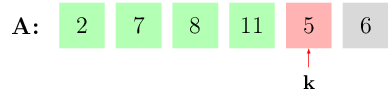
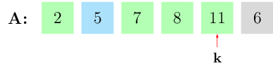
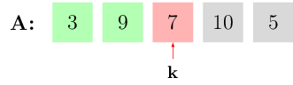
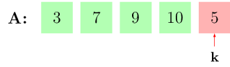

# Proste sortowanie

Popularny (i bardzo naturalny) problem sortowania formułuje się w następujący sposób:

**Dana jest tablica `A[0..n-1]` pewnych elementów, które możemy ze sobą porównywać –
w najprostszej wersji, liczb całkowitych. Chcemy tak przestawić elementy,
aby były one ustawione w kolejności niemalejącej.**

Algorytmów sortowania jest bardzo wiele, różnią się one szybkością działania, prostotą implementacji oraz sytuacjami w jakich można je stosować. W tym rozdziale omówimy szczegółowo trzy proste algorytmy sortowania. W dalszych rozdziałach powrócimy do tematu, aby pokazać algorytmy, które okażą się bardziej efektywne, ale też bardziej skomplikowane.

## Sortowanie bąbelkowe

Jest to jeden z najprostszych do napisania algorytmów, ale (niestety) również nie najszybszy w działaniu. Opiera się na prostej zasadzie: jeśli dwa elementy są ustawione w złej kolejności (większy przed mniejszym), należy je zamienić miejscami. Przejdźmy tak przez całą tablicę, za pomocą następującego fragmentu kodu:

```cpp
for(int i = 0; i < n-1; i++) {
    if (A[i] > A[i+1])	{
        swap(A[i], A[i+1]);
	}
}
```

{class="image-color-invert"}

*Dla `i = 0` nie trzeba nic zamieniać, bo `A[0] < A[1]`...*

{class="image-color-invert"}

*Za to dla `i = 1` mamy `A[1] > A[2]`, więc wykonujemy zamianę.*

{class="image-color-invert"}

*Zamiana wykonana, kontynuujemy procedurę dla `i = 2,3,4`.*

{class="image-color-invert"}

{class="image-color-invert"}

{class="image-color-invert"}

Jak widać na powyższym przykładzie, nie wystarczy to do posortowania wszystkich elementów. Zauważmy jednak, że największy
element tablicy musi po takiej pętli trafić na koniec – od miejsca, na którym stoi, będzie już za każdym razem zamieniany z następnym. Jeśli teraz
powtórzymy procedurę, na przedostatnie miejsce w tablicy trafi drugi w kolejności element. Wystarczy zatem powtórzyć powyższą pętlę $n$ razy, aby mieć
pewnośc, że na swoich miejscach znajdą się wszystkie elementy w tablicy:

```cpp
for(int k = 0; k < n; k++) {
    for(int i = 0; i < n - 1; i++) {
        if (A[i] > A[i + 1]) {
            swap(A[i], A[i + 1]);
		}
	}
}
```

Można jeszcze zauważyć dwa szczegóły: po pierwsze, wystarczy  $n-1$ przebiegów – jeśli  $n-1$ elementów jest na swoich miejscach, ostatni nie
ma innej możliwości. Po drugie, skoro po pierwszym "przebiegu" na końcu jest ostatni element, można już go nie sprawdzać w dalszych iteracjach. Drugą pętlę
wystarczy wykonać do elementu  $n-2$, trzecią do  $n-3$, i tak dalej. Ostateczna wersja algorytmu wygląda zatem następująco:

```cpp
for(int k = 0; k < n-1; k++) {
    for(int i = 0; i < n - k - 1; i++) {
        if (A[i] > A[i + 1]) {
            swap(A[i], A[i + 1]);
		}
	}
}
```

Spróbujmy określić złożoność obliczeniową tego algorytmu. Aby to zrobić, musimy najpierw wybrać najczęściej występującą instrukcję: tradycyjnie przy algorytmach sortowania liczy się porówania, czyli instrukcje postaci `if (x > y) ...` – tak i my postąpimy tym razem, jako że w naszym algorytmie porównanie występuje w każdej iteracji pętli. Alternatywą byłoby np. liczenie przestawień elementów w tablicy – zauważmy, że w na każde porównanie (`if (A[i] > A[i + 1])`) przypada w pesymistycznym wypadku jedno przestawienie (`swap(A[i], A[i + 1])`), więc wynik byłby ten sam.

Dla tablicy o wielkości $n$ wykonujemy $n-1$ porównań w pierwszym obrocie pętli, $n-2$ w drugim, ..., aż do jednego porównania w ostatnim obrocie. Całkowita złożoność wynosi zatem:

\[
  n-1 + n-2 + \ldots + 1 = \frac{n(n-1)}{2} = \frac{1}{2}n^2 - \frac{1}{2}n.
\]

Sortowanie bąbelkowe jest więc algorytmem kwadratowym: doskonale nadaje się
do posortowania 100, czy nawet 1000 liczb, ale już nie 100 000.

## Sortowanie przez wybieranie (selekcję)

Tutaj idea jest bardzo prosta i opiera się na tym, już potrafimy zrobić: algorytmie znajdowania w tablicy największego elementu. Kiedy znajdziemy ten element, po prostu wstawiamy go na koniec tablicy, zamieniając miejscami z elementem, który tam stał:

```cpp

// To oczywiście tylko fragment algorytmu, zaraz będziemy musieli dopisać jeszcze jedną pętlę.
int k = 0;						// k - kandydat na największy element.
for(int i = 0; i < n; i++) {
	if (A[i] > A[k]) {			// Sprawdzamy wszystkie elementy, jeśli i-ty jest lepszy, poprawiamy k.
		k = i;
	}
}
swap(A[k],A[n-1]);				// Element k-ty wstawiamy na koniec tablicy.

```

Teraz ostatni element jest największy, więc stoi na swoim miejscu. Możemy zatem powtórzyć cały algorytm szukania największego elementu, ale ignorując element ostatni w tablicy. Znalezionego kandydata przestawimy na przedostatnią pozycję, po czym oczywiście powtórzymy całość jeszcze raz od początku, tym razem ignorując dwa ostatnie elementy. Postępując tak odpowiednio dużo ($n-1$) razy sprawimy, że tablica będzie posortowana:


```cpp

// Zewnętrzna pętla odpowiada za powtarzanie algorytmu - ma to zrobić n-1 razy.
// Zmienna j również to liczba ignorowanych elementów - na początku 0, a w każdej iteracji o 1 więcej.
for (int j = 0; j < n-1; j++) {
	int k = 0;
	for(int i = 1; i < n-j; i++) {	// Ta pętla musi pominąć ostatnich j elementów, stąd "n-j" zamiast "n".
		if (A[i] > A[k]) {
			k = i;
		}
	}
	swap(A[k],A[n-j]);				// Znaleziony element k-ty wstawiamy na koniec tablicy, ale pomijając ostatnie j elementów.
}
```

Jeśli tutaj policzymy instrukcje porównania `if (A[i] > A[k])`, złożoność wyjedzie identyczna jak w sortowaniu bąbelkowym:

\[
  n-1 + n-2 + \ldots + 1 = \frac{n(n-1)}{2} = \frac{1}{2}n^2 - \frac{1}{2}n.
\]

## Sortowanie przez wstawianie

Wyobraźmy sobie, że początkowa część tablicy – pierwsze $k$ elementów – stoi już we właściwej kolejności, czyli jest posortowana. Idea, na której opiera się nowy algorytm sortowania jest następująca: stosunkowo łatwo jest wstawić nowy element w ten już posortowany ciąg. Po prostu przesuwamy go w lewo, zamieniając z następnym elementem, tak długo aż trafi na swoje miejsce:

```cpp

// Zakładamy, że w tablicy A[0..n-1] pierwsze k elementów - czyli A[0..k-1] - jest już posortowane.
// Próbujemy wstawić element A[k] na swoje miejsce:

int j = k;
while (j >= 0 && A[j] < A[j-1]) {
	swap(A[j],A[j-1]);
	j--;
}


```

Przykład dla sześcioelementowej tablicy oraz `k = 4` pokazany jest poniżej:

{class="image-color-invert"}

*Element `5` musi przesunąć się o kilka pozycji w lewo, aby znaleźć się we właściwym miejscu.*

{class="image-color-invert"}


Bardzo łatwo z tej procedury zrobić cały algorytm sortowania: zauważamy, że na początku możemy przyjąć `k = 0`, czyli założyć, że początkowy fragment tablicy o długości $1$ jest posortowany. Powyższą procedurę wykonujemy teraz kolejno dla `k = 1, 2, \ldots, n-1`. Po każdym `k` wiemy, że `k+1` początkowych elementów jest we właściwej kolejności, a zatem na końcu cała tablica musi być posortowana.

{class="image-color-invert"}


*Element `9` już jest na dobrym miejscu...*

{class="image-color-invert"}

*...ale `7` musi przejść o jedno miejsce w lewo.*

{class="image-color-invert"}

*Elementu `10` nie trzeba ruszać...*

{class="image-color-invert"}

*...za to `5` musi przejść aż o 3 pozycje.*

Cały kod programu wygląda następująco:

```cpp


for(int k = 1; k < n; k++) {			// Ten sam algorytm, co powyżej...
	int j = k;							// ... ale powtarzamy go kolejno dla coraz większych wartości k.
	while (j >= 0 && A[j] < A[j-1]) {
		swap(A[j],A[j-1]);
		j--;
	}
}

```

Jak poprzednio, policzmy instrukcje porównania `A[j] < A[j+1]` w zależności od długości tablicy $n$. Najbardziej pesymistyczna sytuacja ma miejsce, kiedy każdy element musimy wstawiać na sam początek, zamieniając ze wszystkimi poprzednimi. Liczba operacji, liczona pesymistycznie, będzie wtedy taka sama, jak w dwóch poprzednich algorytmach ($\frac{n(n-1)}{2}$). Sortowanie przez wstawianie ma jednak dużą zaletę – działa znacznie szybciej jeśli dane już są częściowo posortowane. O ile formalnie jest to również algorytm kwadratowy, jak poprzednie dwa, o tyle w praktyce stosowany jest częściej.


## Zadania

[Mijanka :fontawesome-solid-paper-plane:](https://szkopul.edu.pl/problemset/problem/ZP0W8yq2dGPTMN8J785_CWSu/site/?key=statement){ .md-button .md-button--primary }

[Smakołyki :fontawesome-solid-paper-plane:](https://szkopul.edu.pl/problemset/problem/uRAmDV-LA0MuunIUGOXBVkur/site/?key=statement){ .md-button .md-button--primary }
