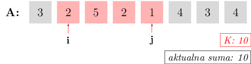
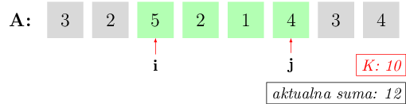

# Sumy w tablicach

## Sumy prefiksowe

Załóżmy, że tak jak poprzednio, mamy tablicę `A[0..n-1]`.
Musimy obliczyć bardzo wiele sum postaci `A[p] + A[p + 1] + ... + A[q]` dla różnych `p` i `q`.
W jaki sposób zrobić to najszybciej?
Bardzo prosto – obliczmy sobie najpierw pomocnicze sumy:

```
S[0] = A[0]
S[1] = A[0] + A[1]
...
S[n - 1] = A[0] + A[1] + ... + A[n - 1]
```

Teraz widać, że `A[p] + A[p + 1] + ... + A[q]` to `S[q] - S[p - 1]`.
Takie pomocnicze sumy nazywają się **sumami prefiksowymi**.
W zadaniach, w których musimy odpowiadać na pewne zapytania (tak jak tutaj o sumy na fragmentach ciągu)
często będziemy używać techniki polegającej na uprzednim
przygotowaniu pomocniczych wartości lub całych struktur danych.
Technika ta zwana jest z angielska **preprocessingiem**.


## Gąsienica

Wróćmy do zadania rozdziału "Złożoność obliczeniowa", o liczeniu fragmentów ciągu o zadanej sumie:

*"Dany jest ciąg złożony z $n$ liczb całkowitych dodatnich. Rozstrzygnąć, ile jest jego fragmentów o sumie równej dokładnie $K$."*

W tamtym rozdziale doszliśmy do algorytmu, który wykonywał około $\frac{1}{2}n^2$ operacji dodawania. Okazuje się, że możemy znaleźć algorytm jeszcze szybszy! Zaczynamy podobnie jak w tamtej wersji: dla każdego dla każdego `i` będziemy chcieli znaleźć takie `j > i`, dla których `A[i] + ... + A[j] = K`. 

Zacznijmy od :math:`i = 0` i zwiększajmy `j`, aż suma `A[0] + A[1] + ... + A[j]` będzie równa `K`:


{class="image-color-invert"}

*W powyższym przykładzie `K = 10`. Dla `i = 0` znaleźliśmy `j = 2`, bo suma `A[0] + A[1] + A[2]` to dokładnie 10.*

Wszystkie większe `j` dałyby już sumę większą niż `K`, nie ma więc sensu ich sprawdzać – możemy porzucić `i = 0` i przejść do `i = 1`. Teraz jednak zamiast zaczynać zupełnie nową pętlę dla `j`, pozostawmy jego aktualną wartość – wszystkie mniejsze `j` dawały zbyt małą sumę przy `i = 0`, więc tym bardziej będą zbyt małe dla `i = 1`. Po prostu zwiększamy zatem `i`, po czym i rozważamy nową aktualną sumę. Może się teraz oczywiście zrobić mniejsza od `K`:

{class="image-color-invert"}

Znowu zwiększamy `j`, aż suma osiągnie `K`: 

{class="image-color-invert"}

Kiedy znajdziemy odpowiedni `j`, znowu zwiększamy `i` i powtarzamy całą procedurę. Co jednak, jeśli dla pewnego `i` nie możemy osiągnąć sumy dokładnie `K`, bo jedna jest zbyt mała, a kolejna już przekracza `K`? Wtedy zatrzymujemy się na pierwszej sumie przekraczającej `K`:

{class="image-color-invert"}

Odpowiedni kod w C++ wygląda następująco:

```cpp
int licznik = 0; // Tu będziemy zliczać fragmenty o sumie K.
int suma = A[0]; // Aktualna suma.
int j = 0;
for (int i = 0; i < n; i++) { // Dla ustalonego i:
    while ((j < n - 1) && (suma < K)) {
        j++; 			// Zwiększaj j, doliczając A[j] do sumy...
        suma += A[j]; 	// ... dopóki suma nie przekroczy K.
	}					// (...albo dopóki j nie osiągnie maksymalnej wartości n - 1.)
    if (suma == K) {
        licznik++;
    }
    suma -= A[i]; // Przechodzimy od i do i + 1, trzeba odliczyć A[i] od sumy.
}
```

Na pierwszy rzut oka mamy w środku podwójną pętlę, więc algorytm wygląda na kwadratowy. Czy jednak na pewno? Pętla wewnętrzna ma zmienną długość, dla różnych `i` będzie wykonywać raz więcej, raz mniej iteracji. Najczęściej wykonywaną instrukcją, wykonującą się w każdej iteracji pętli wewnętrznej, jest instrukcja `j++`, czyli przesunięcie prawego końca przedziału $[i, j]$. Ale wartość zmiennej `j` nie może przekroczyć $n$, a jeśli osiągnie $n$, to wewnętrzna pętla po prostu nie będzie się wykonywać. Zatem instrukcja `j++` może wykonać się łącznie, we wszystkich okrążeniach pętli, co najwyżej $n$ razy. Zatem algorytm wykonuje $n$ operacji, czyli jest liniowy!

Technika ta zwana jest (nieformalnie) **gąsienicą** – fragment tablicy, który składa się na sumę, na przemian ścieśnia się i rozszerza, jednocześnie przesuwając się do przodu tablicy, co przywodzi na myśl poruszanie się gąsienicy.


## Zadania

[Mijanka :fontawesome-solid-paper-plane:](https://szkopul.edu.pl/c/kurs-oi/p/#mij){ .md-button .md-button--primary }

[Smakołyki :fontawesome-solid-paper-plane:](https://szkopul.edu.pl/c/kurs-oi/p/#sma){ .md-button .md-button--primary }
